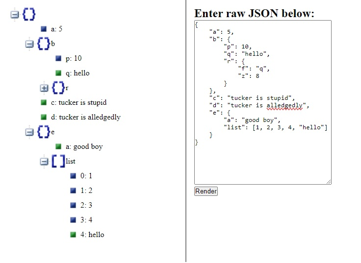

# JSON-Viewer
Converts JSON to a more human readable and interactive format. Inspired by [https://jsonviewer.stack.hu/](https://jsonviewer.stack.hu/)

Built on Node, Express, and JQuery

## Building

#### Download the repository and open a terminal at the root

* Install the neccesary dependencies
  
  `npm install`
   
* Build and run

  `node index.js`

## Example
